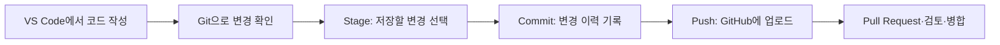
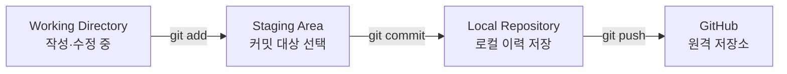

# Git–VS Code–GitHub 활용 방법과 개발 절차

프로그램 개발에서 세 도구는 다음과 같이 역할을 나눕니다.

|도구|역할|쉽게 비유하면|
|---|---|---|
|**VS Code**|프로그램을 작성·수정·실행하는 편집기|작업실|
|**Git**|파일 변경 이력을 내 컴퓨터에 기록·관리|작업 일지|
|**GitHub**|Git 저장소를 인터넷에 보관하고 협업|공동 문서보관소|

핵심은 다음 흐름입니다.



---

## 1. 기본 개념 이해

### 1.1 VS Code

VS Code는 Python, JavaScript, Java 등의 프로그램을 작성하고 실행하는 개발 도구입니다.

VS Code 안에서 다음 작업을 할 수 있습니다.

- 프로그램 파일 작성
    
- 터미널에서 명령 실행
    
- Git 변경 내용 확인
    
- 커밋과 Push
    
- 브랜치 생성 및 전환
    
- 충돌 해결
    
- GitHub Pull Request 관리
    

VS Code의 Git 기능은 별도의 Git을 대체하는 것이 아니라, 컴퓨터에 설치된 Git을 화면에서 편리하게 사용할 수 있게 해주는 기능입니다. [VS Code 소스 제어 공식 문서](https://code.visualstudio.com/docs/sourcecontrol/overview)

### 1.2 Git

Git은 파일의 변경 이력을 관리합니다.

예를 들어 `app.py`를 다음과 같이 수정했다고 가정합니다.

- 최초 버전: “Hello” 출력
    
- 2차 버전: 사용자 이름 입력 기능 추가
    
- 3차 버전: 입력값 검증 기능 추가
    

Git으로 각 버전을 커밋해두면 다음을 할 수 있습니다.

- 누가, 언제, 무엇을 수정했는지 확인
    
- 이전 버전과 현재 버전 비교
    
- 문제가 발생하면 과거 버전으로 복원
    
- 여러 기능을 브랜치에서 따로 개발
    
- 여러 사람의 작업 결과를 병합
    

### 1.3 GitHub

GitHub는 Git 저장소를 온라인에 보관하는 서비스입니다.

GitHub를 사용하면 다음이 가능합니다.

- 소스코드 백업
    
- 팀원과 공동 개발
    
- 버전별 코드 확인
    
- 이슈 등록 및 관리
    
- Pull Request를 통한 검토
    
- 공개 또는 비공개 프로젝트 운영
    

중요한 차이는 다음과 같습니다.

> Git은 내 컴퓨터에서 변경 이력을 관리하고, GitHub는 그 Git 저장소를 인터넷에서 공유·보관합니다.

---

# 2. 개발 환경 준비

## 2.1 프로그램 설치

다음 프로그램을 설치합니다.

1. Git
    
2. VS Code
    
3. 개발 언어 실행 환경
    
    - Python 프로젝트: Python
        
    - JavaScript 프로젝트: Node.js
        
4. GitHub 계정 생성
    

설치 후 VS Code에서 메뉴를 선택합니다.

```text
Terminal → New Terminal
```

다음 명령으로 설치 여부를 확인합니다.

```bash
git --version
code --version
python --version
```

Windows에서 Python 명령이 작동하지 않으면 다음도 확인합니다.

```bash
py --version
```

---

## 2.2 Git 사용자 정보 설정

Git을 처음 설치한 후 이름과 이메일을 등록합니다.

```bash
git config --global user.name "Hong Gil Dong"
git config --global user.email "example@email.com"
```

확인합니다.

```bash
git config --global --list
```

여기에 입력한 이름과 이메일은 커밋 작성자 정보에 사용됩니다.

---

## 2.3 VS Code 확장 프로그램 설치

Python 프로젝트를 예로 들면 다음 확장을 권장합니다.

- Python
    
- Pylance
    
- GitHub Pull Requests
    
- GitLens(선택 사항)
    

기본적인 Git 기능은 VS Code에 내장되어 있으므로 별도의 Git 확장은 필수가 아닙니다.

---

# 3. 신규 프로젝트 전체 실습

간단한 “할 일 관리 프로그램”을 만든다고 가정하겠습니다.

프로젝트 이름은 `todo-app`입니다.

## 3.1 프로젝트 폴더 만들기

터미널에서 실행합니다.

```bash
mkdir todo-app
cd todo-app
code .
```

`code .`은 현재 폴더를 VS Code에서 여는 명령입니다.

또는 파일 탐색기에서 폴더를 만든 후 VS Code에서 다음 메뉴를 선택해도 됩니다.

```text
File → Open Folder
```

---

## 3.2 프로그램 파일 작성

VS Code에서 `app.py` 파일을 만들고 다음 내용을 입력합니다.

```python
tasks = []

while True:
    print("\n1. 할 일 추가")
    print("2. 목록 보기")
    print("3. 종료")

    choice = input("선택: ")

    if choice == "1":
        task = input("할 일을 입력하세요: ")
        tasks.append(task)
        print("등록되었습니다.")

    elif choice == "2":
        print("\n할 일 목록")
        for index, task in enumerate(tasks, start=1):
            print(f"{index}. {task}")

    elif choice == "3":
        print("프로그램을 종료합니다.")
        break

    else:
        print("올바른 번호를 입력하세요.")
```

VS Code 터미널에서 실행합니다.

```bash
python app.py
```

Windows 환경에 따라 다음 명령을 사용할 수도 있습니다.

```bash
py app.py
```

---

# 4. Git 저장소 만들기

프로젝트 폴더에서 다음 명령을 실행합니다.

```bash
git init
```

`git init`은 현재 폴더에 `.git`이라는 관리 영역을 만들고, 해당 폴더를 Git 저장소로 전환합니다. [Git init 공식 문서](https://git-scm.com/docs/git-init)

현재 상태를 확인합니다.

```bash
git status
```

대략 다음과 같이 표시됩니다.

```text
Untracked files:
  app.py
```

`Untracked`는 Git이 아직 `app.py`를 버전 관리 대상으로 기록하지 않았다는 뜻입니다.

---

# 5. Stage와 Commit 이해하기

Git에서는 파일을 수정했다고 바로 버전으로 저장되지 않습니다.



## 5.1 Stage

커밋할 파일을 선택합니다.

```bash
git add app.py
```

모든 변경 파일을 선택하려면 다음과 같이 실행합니다.

```bash
git add .
```

Git의 Stage는 “다음 커밋에 포함할 변경 사항을 고르는 단계”입니다. [Git add 공식 문서](https://git-scm.com/docs/git-add)

확인합니다.

```bash
git status
```

이제 `app.py`가 `Changes to be committed`에 표시됩니다.

## 5.2 Commit

선택한 변경 내용을 하나의 버전으로 기록합니다.

```bash
git commit -m "할 일 관리 프로그램 최초 작성"
```

커밋 메시지는 변경 내용을 알아볼 수 있도록 작성합니다.

좋은 예:

```text
할 일 등록 기능 추가
로그인 오류 수정
사용자 입력값 검증 추가
README 실행 방법 보완
```

좋지 않은 예:

```text
수정
작업
테스트
최종
진짜최종
```

## 5.3 커밋 이력 확인

```bash
git log
```

간단히 확인하려면:

```bash
git log --oneline
```

예:

```text
a13d8f2 할 일 관리 프로그램 최초 작성
```

---

# 6. VS Code 화면에서 커밋하는 방법

터미널 명령 대신 VS Code 화면에서도 동일한 작업을 할 수 있습니다.

1. 왼쪽의 **Source Control** 아이콘 선택
    
2. `Changes`에서 수정된 파일 확인
    
3. 파일명을 클릭하여 변경 전후 비교
    
4. 파일 옆의 `+` 버튼을 눌러 Stage
    
5. 상단 입력란에 커밋 메시지 입력
    
6. `Commit` 버튼 선택
    

명령어와 VS Code 기능은 다음처럼 대응합니다.

|Git 명령|VS Code 화면|
|---|---|
|`git status`|Source Control 변경 파일 목록|
|`git diff`|파일 클릭 후 변경 비교 화면|
|`git add app.py`|파일 옆 `+` 버튼|
|`git add .`|Changes 옆 `+` 버튼|
|`git commit`|Commit 버튼|
|`git pull`|Pull 메뉴|
|`git push`|Push 메뉴|
|`git sync`|Sync Changes|
|`git switch`|좌측 하단 브랜치 이름 선택|

VS Code에서는 커밋 전에 파일을 클릭하여 수정 전후 차이를 확인할 수 있습니다. [VS Code Stage·Commit 공식 문서](https://code.visualstudio.com/docs/sourcecontrol/staging-commits)

---

# 7. GitHub 저장소 생성과 연결

## 7.1 GitHub에서 저장소 만들기

GitHub에 로그인한 후 다음과 같이 진행합니다.

1. 우측 상단 `+` 선택
    
2. `New repository` 선택
    
3. Repository name에 `todo-app` 입력
    
4. 공개 여부 선택
    
    - Public: 누구나 볼 수 있음
        
    - Private: 허용된 사람만 볼 수 있음
        
5. `Create repository` 선택
    

이미 내 컴퓨터에서 `README.md`나 `.gitignore`를 만들었다면 GitHub 저장소 생성 과정에서는 같은 파일을 자동 생성하지 않는 편이 충돌을 줄일 수 있습니다. [GitHub 저장소 생성 공식 문서](https://docs.github.com/en/repositories/creating-and-managing-repositories/creating-a-new-repository)

## 7.2 로컬 Git과 GitHub 연결

GitHub에서 표시되는 저장소 주소를 복사합니다.

예:

```text
https://github.com/사용자이름/todo-app.git
```

터미널에서 실행합니다.

```bash
git remote add origin https://github.com/사용자이름/todo-app.git
```

여기서:

- `remote`: 원격 저장소 관리
    
- `origin`: GitHub 저장소에 붙인 기본 별칭
    
- URL: 실제 GitHub 저장소 주소
    

연결 상태를 확인합니다.

```bash
git remote -v
```

## 7.3 기본 브랜치를 main으로 설정

```bash
git branch -M main
```

## 7.4 GitHub에 최초 업로드

```bash
git push -u origin main
```

각 항목의 의미는 다음과 같습니다.

|항목|의미|
|---|---|
|`push`|로컬 커밋을 원격 저장소에 전송|
|`-u`|로컬 브랜치와 원격 브랜치의 추적 관계 설정|
|`origin`|GitHub 저장소 별칭|
|`main`|업로드할 브랜치|

한 번 연결한 후에는 보통 다음 명령만 사용하면 됩니다.

```bash
git push
```

`git push origin main`은 로컬 `main` 브랜치를 `origin`이라는 원격 저장소의 `main` 브랜치로 전송합니다. [Git push 공식 문서](https://git-scm.com/docs/git-push)

---

# 8. 평상시 반복하는 개발 절차

최초 설정이 끝나면 다음 과정을 반복합니다.

## 8.1 최신 코드 가져오기

협업 프로젝트라면 작업 시작 전에 실행합니다.

```bash
git pull
```

## 8.2 VS Code에서 코드 수정

예를 들어 `app.py`에 할 일 삭제 기능을 추가합니다.

## 8.3 변경 내용 확인

```bash
git status
git diff
```

## 8.4 변경 파일 Stage

```bash
git add app.py
```

## 8.5 커밋

```bash
git commit -m "할 일 삭제 기능 추가"
```

## 8.6 GitHub에 업로드

```bash
git push
```

즉, 일상적인 핵심 흐름은 다음 여섯 단계입니다.

```text
Pull → 수정 → 확인 → Add → Commit → Push
```

---

# 9. Branch를 이용한 안전한 개발

`main` 브랜치는 정상적으로 작동하는 최종 코드를 유지하는 것이 좋습니다.

새로운 기능은 별도 브랜치에서 개발합니다.

예를 들어 “할 일 삭제 기능”을 개발한다면:

```bash
git switch -c feature/delete-task
```

이 명령은 다음 두 작업을 동시에 수행합니다.

1. `feature/delete-task` 브랜치 생성
    
2. 해당 브랜치로 이동
    

현재 브랜치를 확인합니다.

```bash
git branch
```

결과:

```text
* feature/delete-task
  main
```

별표가 현재 작업 중인 브랜치를 나타냅니다.

## 기능 개발 후 저장

```bash
git add app.py
git commit -m "할 일 삭제 기능 구현"
git push -u origin feature/delete-task
```

브랜치는 기존 `main` 코드에 영향을 주지 않고 새로운 기능을 개발할 수 있게 해줍니다. [Git switch 공식 문서](https://git-scm.com/docs/git-switch)

---

# 10. Pull Request를 이용한 협업

브랜치를 GitHub에 Push한 후 바로 `main`에 합치기보다 Pull Request를 사용합니다.

## Pull Request 절차

1. GitHub 저장소 접속
    
2. `Compare & pull request` 선택
    
3. 병합 방향 확인
    
    - base: `main`
        
    - compare: `feature/delete-task`
        
4. 제목과 설명 작성
    
5. `Create pull request` 선택
    
6. 팀원이 코드 검토
    
7. 수정 요청이 있으면 다시 수정·커밋·Push
    
8. 검토 완료 후 `Merge pull request`
    

예시 제목:

```text
할 일 삭제 기능 추가
```

예시 설명:

```text
## 변경 내용
- 목록에서 번호를 선택해 할 일을 삭제하는 기능 추가
- 존재하지 않는 번호 입력 시 안내 메시지 출력

## 확인 사항
- 정상 번호 삭제 테스트 완료
- 잘못된 입력값 예외 처리 확인
```

Pull Request는 한 브랜치의 변경 내용을 다른 브랜치에 반영하도록 제안하고 검토받는 절차입니다. 두 개의 서로 다른 브랜치 사이에서 생성합니다. [GitHub Pull Request 공식 문서](https://docs.github.com/articles/creating-a-pull-request)

---

# 11. Pull Request 병합 후 로컬 정리

GitHub에서 기능 브랜치를 `main`에 병합했다면 내 컴퓨터의 `main`도 최신 상태로 맞춰야 합니다.

```bash
git switch main
git pull origin main
```

작업이 끝난 로컬 브랜치를 삭제합니다.

```bash
git branch -d feature/delete-task
```

GitHub의 원격 브랜치까지 삭제해야 한다면:

```bash
git push origin --delete feature/delete-task
```

일반적인 브랜치 운영은 다음과 같습니다.

```text
main
 ├─ feature/login
 ├─ feature/delete-task
 └─ fix/input-error
```

추천 브랜치 이름:

|목적|예시|
|---|---|
|신규 기능|`feature/login`|
|오류 수정|`fix/login-error`|
|긴급 수정|`hotfix/payment-error`|
|문서 수정|`docs/install-guide`|
|코드 정리|`refactor/task-service`|

---

# 12. 다른 컴퓨터에서 GitHub 프로젝트 시작하기

이미 GitHub에 있는 프로젝트를 새 컴퓨터로 가져올 때는 `clone`을 사용합니다.

```bash
git clone https://github.com/사용자이름/todo-app.git
cd todo-app
code .
```

`clone`을 실행하면 다음 항목이 함께 내려옵니다.

- 프로젝트 파일
    
- 커밋 이력
    
- 브랜치 정보
    
- 원격 저장소 연결 정보
    

따라서 새 컴퓨터에서는 다시 `git init`이나 `git remote add origin`을 할 필요가 없습니다.

---

# 13. 여러 사람이 협업하는 표준 절차

팀원이 새로운 기능을 개발한다고 가정하겠습니다.

## 작업 시작

```bash
git switch main
git pull origin main
git switch -c feature/task-deadline
```

## 개발 및 커밋

```bash
git status
git add app.py
git commit -m "할 일 마감일 기능 추가"
```

## GitHub에 업로드

```bash
git push -u origin feature/task-deadline
```

## GitHub에서 검토

```text
Pull Request 생성
→ 팀원 검토
→ 수정 요청
→ 추가 커밋·Push
→ 승인
→ main 병합
```

## 병합 후 다음 작업 준비

```bash
git switch main
git pull origin main
git branch -d feature/task-deadline
```

---

# 14. Git 충돌 발생과 해결

두 사람이 `app.py`의 같은 부분을 서로 다르게 수정하면 충돌이 발생할 수 있습니다.

예를 들어 `git pull` 실행 시:

```text
CONFLICT (content): Merge conflict in app.py
```

충돌 파일에는 다음과 같은 표시가 생깁니다.

```python
<<<<<<< HEAD
print("할 일 목록")
=======
print("나의 할 일")
>>>>>>> origin/main
```

의미는 다음과 같습니다.

- `HEAD` 위쪽: 내 컴퓨터의 코드
    
- 구분선 아래쪽: GitHub에서 가져온 코드
    

VS Code에서는 다음 선택지가 표시됩니다.

- Accept Current Change: 내 변경 유지
    
- Accept Incoming Change: 상대방 변경 유지
    
- Accept Both Changes: 양쪽 모두 유지
    
- Compare Changes: 두 내용을 비교
    

원하는 코드로 정리한 후 충돌 표시를 제거합니다.

```python
print("나의 할 일 목록")
```

그다음 다시 커밋합니다.

```bash
git add app.py
git commit -m "할 일 목록 문구 충돌 해결"
git push
```

VS Code는 충돌 파일 표시와 3-way Merge Editor를 제공합니다. [VS Code 충돌 해결 공식 문서](https://code.visualstudio.com/docs/sourcecontrol/merge-conflicts)

---

# 15. `.gitignore` 파일 사용

프로젝트의 모든 파일을 GitHub에 올리면 안 됩니다.

다음 파일은 일반적으로 제외합니다.

- 비밀번호와 API Key
    
- 가상환경
    
- 캐시 파일
    
- 로그 파일
    
- 빌드 결과
    
- 개인 환경설정
    
- 대용량 임시 데이터
    

Python 프로젝트의 `.gitignore` 예:

```gitignore
# Python cache
__pycache__/
*.pyc

# Virtual environment
.venv/
venv/

# Environment variables and secrets
.env
.env.*

# VS Code personal settings
.vscode/

# Logs
*.log

# Operating system
.DS_Store
Thumbs.db
```

그 후 커밋합니다.

```bash
git add .gitignore
git commit -m "Git 제외 파일 설정"
git push
```

주의할 점은 API Key가 포함된 파일을 이미 커밋했다면, 나중에 `.gitignore`에 추가하는 것만으로 기존 기록에서 사라지지 않는다는 것입니다. 이 경우 해당 Key를 즉시 폐기하고 새로 발급해야 합니다.

---

# 16. README 작성

GitHub 저장소에는 프로젝트 설명서인 `README.md`를 두는 것이 좋습니다.

예:

````markdown
# Todo App

Python으로 작성한 간단한 할 일 관리 프로그램입니다.

## 주요 기능

- 할 일 등록
- 할 일 목록 조회
- 할 일 삭제

## 실행 환경

- Python 3.12 이상

## 실행 방법

```bash
python app.py
````

## 개발자

홍길동

````

README를 저장한 후:

```bash
git add README.md
git commit -m "프로젝트 사용 설명 추가"
git push
````

---

# 17. 자주 사용하는 Git 명령어

|명령어|용도|
|---|---|
|`git init`|현재 폴더를 Git 저장소로 생성|
|`git clone URL`|GitHub 저장소 복제|
|`git status`|변경 상태 확인|
|`git diff`|수정 내용 비교|
|`git add 파일명`|특정 파일 Stage|
|`git add .`|전체 변경 파일 Stage|
|`git commit -m "메시지"`|로컬 변경 이력 저장|
|`git log --oneline`|커밋 이력 간단히 확인|
|`git branch`|브랜치 목록 확인|
|`git switch 브랜치명`|브랜치 이동|
|`git switch -c 브랜치명`|브랜치 생성 후 이동|
|`git pull`|GitHub의 변경 내용 가져오기|
|`git push`|로컬 커밋을 GitHub에 전송|
|`git remote -v`|연결된 원격 저장소 확인|
|`git restore 파일명`|커밋하지 않은 파일 수정 취소|
|`git restore --staged 파일명`|Stage에서 파일 제외|
|`git stash`|미완성 변경 내용을 임시 보관|
|`git stash pop`|임시 보관 내용 다시 적용|

---

# 18. 실수했을 때 복구하는 방법

## 파일 수정 내용을 취소하고 싶을 때

아직 Stage하지 않았다면:

```bash
git restore app.py
```

이 명령은 현재 수정 내용을 없애므로 실행 전에 정말 취소해도 되는지 확인해야 합니다.

## Stage만 취소하고 싶을 때

```bash
git restore --staged app.py
```

파일 수정 내용은 그대로 유지되고 Stage에서만 빠집니다.

## 직전 커밋 메시지를 바꾸고 싶을 때

아직 Push하지 않았다면:

```bash
git commit --amend -m "수정된 커밋 메시지"
```

## 과거 코드 확인

```bash
git log --oneline
git show 커밋ID
```

협업 저장소에 이미 Push한 커밋은 임의로 이력을 다시 쓰지 않는 것이 안전합니다. 일반적으로 `git revert`로 되돌림 커밋을 새로 만드는 방법을 사용합니다.

```bash
git revert 커밋ID
```

---

# 19. 권장 실무 운영 규칙

## 개인 프로젝트

```text
main에서 개발
→ 기능 단위 커밋
→ GitHub Push
```

작은 연습 프로젝트라면 이 방법도 가능합니다.

## 팀 프로젝트

```text
main 최신화
→ 기능 브랜치 생성
→ 개발
→ 테스트
→ 커밋
→ Push
→ Pull Request
→ 코드 검토
→ main 병합
```

## 중요한 원칙

1. 작업 시작 전에 `git pull`을 실행합니다.
    
2. 한 커밋에는 하나의 의미 있는 변경을 담습니다.
    
3. 작동하지 않는 코드는 `main`에 직접 Push하지 않습니다.
    
4. 신규 기능은 별도 브랜치에서 작업합니다.
    
5. 비밀번호와 API Key는 절대로 커밋하지 않습니다.
    
6. Push 전에 `git status`와 변경 내용을 확인합니다.
    
7. 커밋 메시지만 보고도 변경 내용을 알 수 있게 작성합니다.
    
8. 대용량 데이터와 실행 결과물은 별도 저장소를 검토합니다.
    
9. 팀 프로젝트는 Pull Request 검토 후 병합합니다.
    
10. `git push --force`는 공유 브랜치에서 함부로 사용하지 않습니다.
    

---

# 20. 가장 실용적인 전체 절차 요약

## 프로젝트 최초 생성 시 한 번만 실행

```bash
mkdir todo-app
cd todo-app
code .

git init
git add .
git commit -m "프로젝트 최초 생성"
git branch -M main
git remote add origin https://github.com/사용자이름/todo-app.git
git push -u origin main
```

## 새로운 기능을 개발할 때마다 실행

```bash
git switch main
git pull origin main
git switch -c feature/기능이름

# VS Code에서 프로그램 수정 및 테스트

git status
git diff
git add .
git commit -m "기능 설명"
git push -u origin feature/기능이름
```

그다음 GitHub에서:

```text
Pull Request 생성
→ 코드 검토
→ Merge
```

병합 후:

```bash
git switch main
git pull origin main
git branch -d feature/기능이름
```

처음에는 명령어가 복잡해 보이지만, 실제 개발에서 가장 많이 반복하는 것은 다음 네 개입니다.

```bash
git pull
git add .
git commit -m "변경 내용"
git push
```

여기에 팀 협업을 할 때만 브랜치와 Pull Request 절차를 추가한다고 이해하면 가장 쉽습니다.